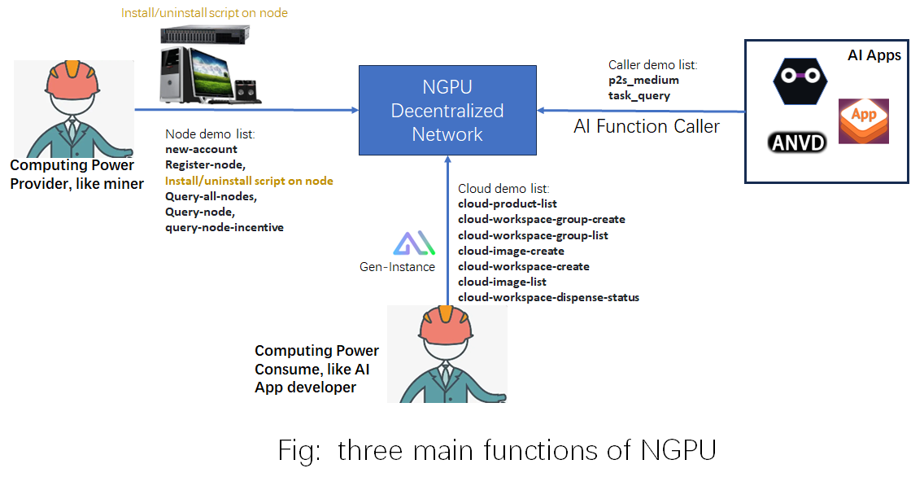
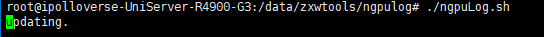
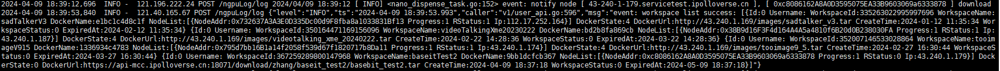
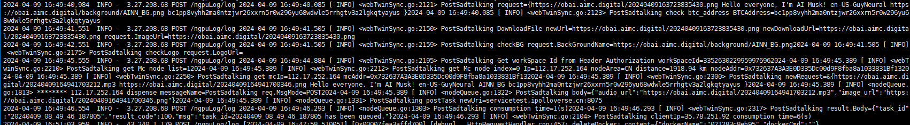

NGPU-Cli
=======
python cmd for ngpu main api calls.
-----------

## Notes
NGPU, as a decentralized GPU computing platform, mainly functions include:
- Computing power providers can register, install, uninstall nodes, inquire about node information and incentives.
- Computing consumer can inquire about the product list provided by the platform, upload their own images to generate Gen-Instances, create workspaces based on their own and platform images, dispatch them, check the issuance status, and prepare for subsequent AI service requests.
- AI applications can request AI service APIs provided by Gen-Instances and check their status, returning results. 



The followings are 3 parts correponding to the above functions.
* [**Node part**](#Node-part): If you want to provide GPU for NGPU, read this note
* [**Cloud part**](#Cloud-part): If you want to use the GPU computing power in NGPU, read this note
* [**Caller part**](#Caller-part): If you want to call AI on NGPU, read this note

## Installation

```shell
Python environment is 3.12, so run python -V, return 3.12
To install packages, please pip install -r requirements.txt 
```

## **Node part**: 

### Command Line Example and Explanation

#### 1.  **new-account**
```shell
$ python3 main.py new-account
```
Command Explanation：
- Create a computational power node address (this address uses an ETH address, so ETH addresses obtained through other means can also be used).

Response:
```shell
{
    "passWD": "888888",
    "fileName": "0xf942f1adc3bfc57cf075476236eee476199e853a_keystroe.json",
    "keystore": "{\"address\":\"f942f1adc3bfc57cf075476236eee476199e853a\",\"crypto\":{\"cipher\":\"aes-128-ctr\",\"ciphertext\":\"01993647630f506ed08a0897a2d5b9c070cd4d26da4178e27fa8c222ea25c2ee\",\"cipherparams\":{\"iv\":\"de459d6d742cdcfd49311a2bcc224777\"},\"kdf\":\"scrypt\",\"kdfparams\":{\"dklen\":32,\"n\":262144,\"p\":1,\"r\":8,\"salt\":\"3090949f8ca9e51f9a82abcbcd0f994f65367b399e86bc7d59b62f647e85dc5a\"},\"mac\":\"cf6e1997a3c62d7e47b5c414be5f4f20330d2ce77279024cd9fa5673df4f4532\"},\"id\":\"3010e90c-4478-42d3-b8ef-79ddd0cadd3a\",\"version\":3}"
}
```
Parameter:
- --passWD: Create a generated keystore password
- --fileName: Create a generated keystore file name
- --keystore: Create the content of the generated keystore file
Please pay attention: <font color="red">the new node address is keystore.address. In above case, it is f942f1adc3bfc57cf075476236eee476199e853a.</font>
#### 2. **register-node**
```shell
$ python3 main.py register-node --node-addr < Computational Power Node Address > --organization < Organization Name > --wallet-account < Wallet Address >
```
Command Explanation:
- Register a computational power node on AINNGPU

Parameter:
- --node-addr: from new-account return
- --organization: customize by yourself
- --wallet-account: your eth address(incentive address), not node-address

#### 3. **query-all-nodes**
```shell
$ python3 main.py query-all-nodes 
```
Command Explanation:
- Query all current computational power nodes


#### 4. **query-node**
```shell
$ python3 main.py query-node --node-addr f942f1adc3bfc57cf075476236eee476199e853a 
```
Command Explanation:
- Retrieve detailed information of a computational power node based on its address

Parameter:
- --node-addr: The computational power node address you need to query

#### 5. **query-node-incentive**
```shell
$ python3 main.py query-node-incentive --node-addr f942f1adc3bfc57cf075476236eee476199e853a 
```
Command Explanation:
- Query all current computational power nodes

Parameter:
- --node-addr: The computational power node address you need to query


### **_Operation Steps_**
1. **Step One**: Create a computational power node address (you can skip this step if you already have an ETH address).
```shell
$ python3 main.py new-account
```
Assuming the returned address is: f942f1adc3bfc57cf075476236eee476199e853a 

2. **Step Two**: Register the computational power node address with the AINNGPU platform.
```shell
$ python3 main.py query-node --node-addr f942f1adc3bfc57cf075476236eee476199e853a 
```
3. **Step Three**: <font color="red">Run the following installation script ONLY on a computing node, other than test client. To install nvidia driver, install script shall run with root priviledge. </font>
```shell
git clone https://github.com/AINNGPU-Community/ngpu-install-script.git ;  cd ngpu-install-script; chmod +x -R *.sh; sudo ./install_mcNode.sh \
   --nodeAddr   f942f1adc3bfc57cf075476236eee476199e853a \
   --nodeName myNode1 \
   --ipAddr 192.168.1.100 \
   --home /home/ngpu-client \
   --storage 1000   
```
Parameter:
- nodeAddr: node address from step 1, new-account（As long as it's an ETH address, it's fine. It doesn't have to be the address returned by the new-account interface.）
- nodeName: node name, please use any string as you like.
- ipAddr: ip address from ifconfig or ip -4 a, for multi-network cards, please use the NIC via which computer access internet.
- home: root path for ngpu client, where all ngpu files live.
- storage: committed storage, in GB. Client checks the storage during measurement and if free volumn of $home is less than this, all the volumn will be used.

#### **More details, like node requirements, are at [node client install](https://github.com/AINNGPU-Community/ngpu-install-script)**.
#### **You may need to wait for the network to measure your PC after installation, esp. the storage is more than 1000 GB**.


4. **Step Four**: Query the incentive amount received by the computational power node
```shell
$ python3 main.py query-node-incentive --node-addr f942f1adc3bfc57cf075476236eee476199e853a
```

## Cloud part

### Command Line Example and Explanation

#### 1. create workspace
```shell
$ python3 main.py cloud-workspace-create --name=< workspace name for yourself > \
    --image-id=< one of cloud-image-list return > \
    --product-id=< one of cloud-product-list > \
    --unit=< one of "hr" or "week" or "month" > \
    --duration=< int > \
    --node-num=< int > \
    --group-id=< not required ,one of cloud-workspace-group-list return >
```
Command Explanation:
- Create a workspace

Parameter:
- name: required. The name of the created workspace, unique.
- image-id: required. From cloud-image-list cmd, return id in json map item. If you want to create image, refer to
  cloud-image-create cmd.
- product-id: required. From cloud-product-id, return product id in json map item. Choose you need GPU type.
- unit: required. Duration unit include `hr`(pre hour), `week`(pre week), `month`(pre month).
- duration: required. You want to use GPU time.
- node-num: required. You want to use node num.
- group-id: if node-num > 1, setting it. From cloud-workspace-group-list cmd return group id in json map item.

Response:
- workspace id [<str>]


#### 2. create image

```shell
$ python3 main.py cloud-image-create --name=<str> \
    --name=<str>
    --wget-url=<str>
    --note=<str>
    --start=<str>
    --ports=<str>
    --docker-image-id=<str>
```
Response:
- image id [<str>]

Parameter:

- name: required. The name of the created image, unique.
- wget-url: required. download docker tar file url.
- note: this image description.
- start: required. Docker run cmd.
- ports: required. Docker run ports param.
- docker-image-id: Docker image id from `$ docker images` info.

Response:
- image id: used in cloud-workspace-create

#### 3. image list 
```shell
$ python3 main.py cloud-image-list
 ```


Response:
```shell
[
    {
        "id": "312243674765329408",
        "image_name": "stable diffusion",
        "file_size": 18022273024,
        "created_at": "2023-07-20 11:37:11",
        "note": "stable diffusion standard version, containing SD 1.5 model",
        "action": 1,
        "start_cmd": "docker run -d --gpus all  -p 7860:7860 e795e95b9616 /data/stable-diffusion-webui/webui.sh --listen --api",
        "stop_cmd": "",
        "port_mapping": "7860:7860",
        "exception": 1,
        "is_system": true,
        "docker_image_id": "e795e95b9616"
    },
    ...
]
```
Parameter:
- id: imageid used cloud-workspace-create.
- image_name: image name
- docker_image_id: docker image id from `$ docker images` info.
- start_cmd: docker run cmd.
- port_mapping: docker run --ports param.

* <span style="color:green;"> **_Get image id for `cloud-workspace-create --image-id` parameter_** </span>


#### 4. create group

```shell
$ python3 main.py cloud-workspace-group-create --name=<str>
```

Response:
- workspace group id [<str>]

Parameter:
- name: required, unique. The name of the created.

#### 5. group list

```shell
$ python3 main.py cloud-workspace-group-list
```
Response:
```shell
[
    {
        "id": "362502199797875713",
        "workspace_group_name": "testgroup"
    },
    {
        "id": "362502199797875714",
        "workspace_group_name": "aaa"
    }
]
```
Parameter:
- id: group id used cloud-workspace-create
- workspace_group_name: unique, group name

* <span style="color:green;"> **_Get group id for `cloud-workspace-create --group-id` parameter_** </span>


#### 6. product list

```shell
$ python3 main.py cloud-product-list
```
Response:
```shell
[
    {
        "id": 10,
        "product_name": "PGPU-3090-24G-nCN",
        "gpu_name": "NVIDIA GeForce RTX 3090",
        "gpu_type": "NVIDIA GeForce RTX",
        "gpu_model": "3090",
        "video_memory": 24,
        "core_num": 16,
        "memory": 64,
        "storage": 1000,
        "net_band": 50,
        "operating_system": "Ubuntu20.04LTS x64",
        "hour_price": 0.28,
        "month_price": 157,
        "week_price": 280,
        "area": "!CN",
        "description": "3090 out of China"
    }
]
```
Parameter:
- id: <span style="color:green;"> **_product id for `cloud-workspace-create --product-id` parameter_**</span>
- gpu_name: gpu name
- operating_system: os
- hour_price: price per hour
- week_price: price per week
- month_price: price per month

#### 7. check workSpace status

```shell
$ python3 main.py cloud-workspace-dispense-status
```
Response:
```shell
[
    {
        "id": 10,
        "product_name": "PGPU-3090-24G-nCN",
        "gpu_name": "NVIDIA GeForce RTX 3090",
        "gpu_type": "NVIDIA GeForce RTX",
        "gpu_model": "3090",
        "video_memory": 24,
        "core_num": 16,
        "memory": 64,
        "storage": 1000,
        "net_band": 50,
        "operating_system": "Ubuntu20.04LTS x64",
        "hour_price": 0.28,
        "month_price": 157,
        "week_price": 280,
        "area": "!CN",
        "description": "3090 out of China"
    }
]
```
Parameter:
- id: <span style="color:green;"> **_product id for `cloud-workspace-create --product-id` parameter_**</span>
- gpu_name: gpu name
- operating_system: os
- hour_price: price per hour
- week_price: price per week
- month_price: price per month


### **_Operation Steps_**
1. **Step One**: Create a workspace.
```shell
$ python3 main.py cloud-workspace-create --name=<workspace name for yourself> \
    --image-id=28 \
    --product-id=10 \
    --unit="week" \
    --duration=1 \
    --node-num=1
```
 - <span style="color:red;"> **_When you don't know the image-id parameter, you can use the cloud-image-list command to obtain it or use the cloud-image-create command to create a new image_**. </span>
 - <span style="color:red;"> **_When you don't know the product-id parameter, you can use the cloud-product-list command to obtain it_**. </span>
 - <span style="color:red;"> **_When you don't know the group-id parameter, you can use the cloud-workspace-group-list command to obtain it or use the cloud-workspace-group-create command to create a new group_**. </span>


2. **Step Two**: Check the distribution status of your workspace.
```shell
$ python3 main.py cloud-workspace-dispense-status --id=<str>
```
Parameter:
- id: The workspace ID obtained through the cloud-workspace-create command


## Caller part

### Command Line Example and Explanation

#### 1. **create p2s_medium**

```shell
$ python3 main.py p2s_medium --image_url=<str> --text=<str> --pronouncer=<str> --btc_address=<str> --logo_url=<str>
```
Command Explanation:
- Generate a video using photos.

Parameter:
- --image_url: URL Address of the Image
- --text: Spoken Content in the Video
- --pronouncer：Speaker used in the video
- --btc_address：BTC address (used to check for AINN and other BRC20 assets)
- --logo_url：Logo cloud address used in the video

#### 2. **task_query**

```shell
$ python3 main.py task_query  --taskID=<str>
```
Command Explanation:
- Get detailed information about the task based on its task ID.

Parameter:
- --taskID: Task ID

### **_Operation Steps_**
1. **Step One**: Generate a video from photos using an AI interface.
```shell
$ python3 main.py p2s_medium --image_url https://obai.aimc.digital/20240328170028340811.jpg --text Hello\ everyone,\ I\ am\ AI-generated\ Musk --pronouncer en-US-GuyNeural --backGroundName https://obai.aimc.digital/background/AINN_BG.png --btc_address bc1pp8vyhh2ma0ntzjwr26xxrn5r0w296yu68wdwle5rrhgtv3a2lgkqtyayus
```
<span style="color:red;">Return the task ID and the URL address of the generated video </span>

2. **Step Two**: Query the detailed information of the task after execution
```shell
$ python3 main.py task_query --taskID 20240402_06_47_00_789580 
```

Response:
```shell
{
    "result_code": 200,
    "msg": "success",
    "task": {
        "userkey": "btc-fc9a1161-9d9d-41b4-833f-e2b7622de9d4",
        "btcaddress": "bc1pp8vyhh2ma0ntzjwr26xxrn5r0w296yu68wdwle5rrhgtv3a2lgkqtyayus",
        "workspaceid": "335263022995997696",
        "taskid": "20240402_06_47_00_789580",
        "requrl": "/user/sadTalker",
        "method": "sadTalker",
        "userip": "58.34.91.211",
        "nodeip": "112.17.252.164",
        "nodeaddr": "0x732637A3A3E0D335Dc00d9F8fba8a1033831Bf13",
        "requesttime": "2024-04-02 14:47:01",
        "responsetime": "2024-04-02 14:48:06",
        "request": "{\"audio_url\":\"https://obai.aimc.digital/20240402144655978890.mp3\",\"video_url\":\"https://obai.aimc.digital/20240402144655975261.jpg\",\"text\":\"Hello everyone, I am AI-generated Musk\",\"pronouncer\":\"en-US-GuyNeural\",\"backGroundName\":\"AINN_BG\",\"btc_address\":\"bc1pp8vyhh2ma0ntzjwr26xxrn5r0w296yu68wdwle5rrhgtv3a2lgkqtyayus\",\"logo_url\":\"\"}",
        "state": 3,
        "response": "{\"result_url\":\"http://112.17.252.164:8076/4262d58a-06e1-4575-8e10-bd30d0abf60f/2024040214465597526120240402144655978890_full.mp4\",\"result_code\":100,\"msg\":\"task(20240402_06_47_00_789580) has succeeded.\",\"api_time_consume\":3.78,\"api_time_left\":0,\"video_w\":906,\"video_h\":1196,\"gpu_type\":\"\",\"gpu_time_estimate\":0,\"gpu_time_use\":0}",
        "recordDursion": 65,
        "videodursion": 3,
        "gpudursion": 0,
        "watermarktime": "2024-04-02 14:48:43",
        "watermarkres": "{\"result_url\":\"https://obai.aimc.digital/20240402144840988057.mp4\",\"result_code\":100,\"msg\":\"task(20240402_06_47_00_789580) has succeeded.\",\"api_time_consume\":3.78,\"api_time_Left\":0,\"video_w\":906,\"video_h\":1196,\"gpu_type\":\"\",\"gpu_time_estimate\":0,\"gpu_time_use\":0,\"first_image\":\"https://obai.aimc.digital/20240402144842770421.png\"}",
        "servername": "Brc20_ApiServer"
    }
}
```

Parameter:
- --btcaddress: BTC address (used to check for AINN and other BRC20 assets)
- --workspaceid: Spoken Content in the Video
- --taskid： Task ID
- --requrl：Request Path
- --method：Request Method
- --userip：User's Request IP
- --nodeip：Node IP Handling the Task
- --nodeaddr：Node Address Handling the Task
- --requesttime：Request Time
- --responsetime：Response Time
- --request：Request Content
- --state：Current Task Status
- --response：Response Content
- --recordDursion：GPU Consumption Time (Seconds)


## View the NGPU log? 

**Step One**：Copy log/ngpuLog.sh to a Linux computer (Ubuntu is recommended).

**Step Two**：Execute the command to generate the log file.
```shell
1. chmod +x ngpuLog.sh
2. ./ngpuLog.sh
```

**Step Three**：View the generated log file (ngpu.log).
```shell
tail -f ngpu.log
```
log format is like {time}  {LogLevel} - {source IP} {Http method} {Http Uri} {log content}. LogLevel is fixed to INFO. Http method is POST, and Uri is /ngpuLog/log. 

Now, there are 4 kinds of logs
1. Node client ipvRunner, which is from /ngpu-node-client repository. The log is in plain text, and the format is {time} {thread id} {log level} {source file name and line number} {log info}. The following figure is one example.

2. backend applications, 121.196.222.24 and 121.40.165.67, whose logs show how to create image and workspace, dispatch and list. 
The following figure contains dispatch info and workspace info.

3. api-server, whose logs show the workflow for every ai action.
The following figure contains main steps of sadtalking which makes one video from photos and texts. 
